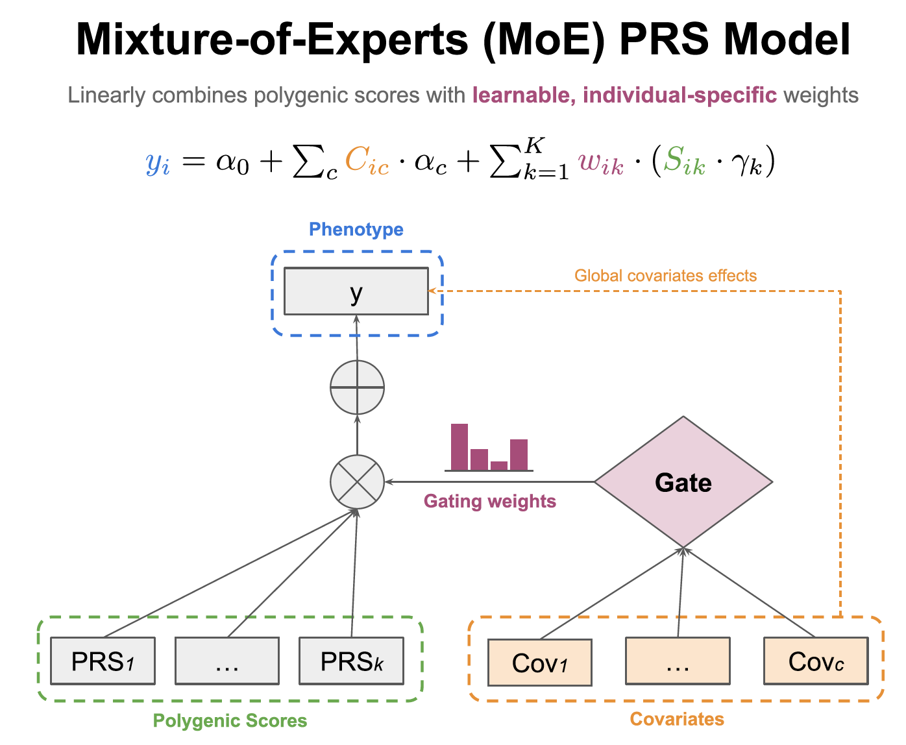

# Personalized polygenic risk prediction and assessment with a Mixture-of-Experts framework (2025)

Shadi Zabad, Yue Li, Simon Gravel

**McGill University**

[](https://creativecommons.org/licenses/by-nc/4.0/)

---

This repository contains code and scripts to reproduce all the analyses in our manuscript, which proposes 
an ensemble learning technique for polygenic risk scores (PRS) inference. The `MoEPRS` model takes as input a set of 
pre-trained polygenic scores (inferred from various biobanks or strata) as well as individual-level data 
for a validation dataset and learns to assign individuals the best scores for them in a personalized-manner.

<div style="text-align: center;">
    
</div>

To get an intuitive understanding of what the `MoEPRS` model is set up to do, please check the 
[notebooks directory](https://github.com/shz9/moe-prs-paper/tree/main/notebooks), which includes simple, 
intuitive examples with simulations and associated visualizations.

---

## Installation

The code base is still in experimental phase and needs some more work to streamline the installation. 
To get started with the current code base, please clone the repository and then install the dependencies:

```bash
git clone https://github.com/shz9/moe-prs-paper.git
pip install -r moe-prs-paper/requirements.txt
```

## Steps to reproduce the analyses and results

Our analyses involve using individual-level data that is not publicly available. However, if you have access to
the UK or CARTaGENE biobanks, you should be able to replicate all the steps in here. If you have access to 
third party datasets that you'd like to use the `MoEPRS` model on, then you can modify some of the steps to 
ensure that your data conforms to the same formats.

---

### Step 0: Data Preparation

Fitting the `MoEPRS` model to validation data requires extracting and pre-processing the three following data
sources:

1. **Genotype and phenotype data for a large number of individuals** (ideally > 1000): `MoEPRS` requires a validation 
dataset with paired genotype and phenotype data. For a phenotype of interest, let's say standing height, you need 
to extract the phenotype data and pre-process it before model fitting.
2. **Polygenic score weights**: Once you decide on the phenotype of interest, then you should also collect relevant 
stratified polygenic scores for that same phenotype. Here, you can either use the [PGS Catalog](https://www.pgscatalog.org/)
or in-house polygenic score weights.
3. **Covariates**: In our setup, the gating model takes as input individual attributes (i.e. covariates) and uses
them to learn cohort partitions. These covariates can be things like the individual's age, sex, genomic PCs. Note that 
we also correct for covariates effects globally to ensure that the gate does not pick on spurious, non-genetic variation.

#### Step 0.1: Extract / collecting polygenic score weights
In our pipeline, the first step was to download the polygenic scores from the PGS Catalog, which can be done
with the help of the scripts [batch_download_pgs.py](https://github.com/shz9/moe-prs-paper/tree/main/data_preparation/1_prepare_pgs_weights/batch_download_pgs.py)
or [download_pgs.py](https://github.com/shz9/moe-prs-paper/tree/main/data_preparation/1_prepare_pgs_weights/download_pgs.py)

**NOTE**: If your polygenic score weights are not from the PGS Catalog, then please ensure that they are formatted 
using the PGS Catalog PRS file format. This is important because we use `pgsc_calc` software utility from the PGS 
Catalog to perform scoring in the next steps.

#### Step 0.2: Extracting individual-level data from each biobank

Once these PGSs are downloaded and harmonized, then the next step is to extract and prepare the individual-level 
data. Here, each biobank will be different, but if you have access to the UK/CARTaGENE Biobanks, then you can
follow the steps in these directories:

1. **UK Biobank**: Data preparation scripts are [here](https://github.com/shz9/moe-prs-paper/tree/main/data_preparation/2_prepare_validation_data/ukbb)
2. **CARTaGENE Biobank**: Data preparation scripts are [here](https://github.com/shz9/moe-prs-paper/tree/main/data_preparation/2_prepare_validation_data/cartagene) 

The scripts in these directories will: Extract necessary genotype data, phenotype data, as well as covariates.

#### Step 0.3: Perform linear scoring using genotype data

To generate polygenic scores for individuals in the validation data, we are going to use the `pgsc_calc` software 
utility from the PGS Catalog. The benefit of this framework is that it provides standardized ways to tackle 
genotype data in various formats (`.bed`, `.pgen`, etc.) and it also handles lifting over coordinates, if necessary.

To see how we used the utility for both the UK and CARTaGENE biobanks, refer to the scripts in these directories:

1. **UK Biobank**: Scripts for scoring with `pgsc_calc` are [here](https://github.com/shz9/moe-prs-paper/tree/main/data_preparation/3_pgsc_calc_pipeline/ukbb).
2. **CARTaGENE Biobank**: Scripts for scoring with `pgsc_calc` are [here](https://github.com/shz9/moe-prs-paper/tree/main/data_preparation/3_pgsc_calc_pipeline/cartagene).

#### Step 0.4: Harmonizing the data

Once all the input data sources have been extracted or computed, then the next step is to harmonize them into a single
data frame. This can be done with the help of the utility script [create_datasets.py](https://github.com/shz9/moe-prs-paper/tree/main/data_preparation/4_generate_datasets/create_datasets.py).
Note that this script, in its default settings, will ask you for the paths of: (1) the phenotype file, (2) the polygenic score files,
and (3) the covariates file.

---

### Step 1: Model fitting

Once your datasets have been extracted and pre-processed, then you can go ahead and experiment with fitting 
the `MoEPRS` model or even the baseline `MultiPRS`. Both of these models are implemented in:

1. [model/moe.py](https://github.com/shz9/moe-prs-paper/tree/main/model/moe.py): Implements the `MoEPRS` model using the EM algorithm.
2. [model/baseline_models.py](https://github.com/shz9/moe-prs-paper/tree/main/model/baseline_models.py): Implements the baseline models, including the `MultiPRS`.

To see an example of how both of these models are used from the `python` API, see the [notebooks directory](https://github.com/shz9/moe-prs-paper/tree/main/notebooks).
To run these models in batch mode for a bunch of different phenotypes, then you can use the [train_models.py](https://github.com/shz9/moe-prs-paper/tree/main/model/train_models.py) utility script.

**NOTE**: You can also explore the `PRSDataset` class, which implements a python wrapper around the simple 
dataframe and provides many functionalities for pre-processing and working with PRS and phenotype data.


---

### Steps 2 / 3: Evaluation and visualization

Once the ensemble PRS models have been trained, the next step is to evaluate their performance and examine 
the learned representations using a number of visualization and analysis tools.

For **evaluation**, you can consult the script [evaluation/evaluate_predictive_performance.py](https://github.com/shz9/moe-prs-paper/tree/main/evaluation/evaluate_predictive_performance.py),
which provides utilities for computing stratified evaluation metrics.

For **visualization**, you can consult the scripts in [plotting/](https://github.com/shz9/moe-prs-paper/tree/main/plotting/),
which provide utilities for plotting the evaluation metrics as well as generating the PGS admixture 
graphs highlighted in the text. If you're interested in experimenting with the PGS admixture graphs in particular, check the script 
[plotting/plot_pgs_admixture.py](https://github.com/shz9/moe-prs-paper/tree/main/plotting/plot_pgs_admixture.py).

---

## Citation

```
@article {Zabad2025.09.15.676165,
	author = {Zabad, Shadi and Li, Yue and Gravel, Simon},
	title = {Personalized polygenic risk prediction and assessment with a Mixture-of-Experts framework},
	elocation-id = {2025.09.15.676165},
	year = {2025},
	doi = {10.1101/2025.09.15.676165},
	publisher = {Cold Spring Harbor Laboratory},
	URL = {https://www.biorxiv.org/content/early/2025/09/17/2025.09.15.676165},
	eprint = {https://www.biorxiv.org/content/early/2025/09/17/2025.09.15.676165.full.pdf},
	journal = {bioRxiv}
}
```
